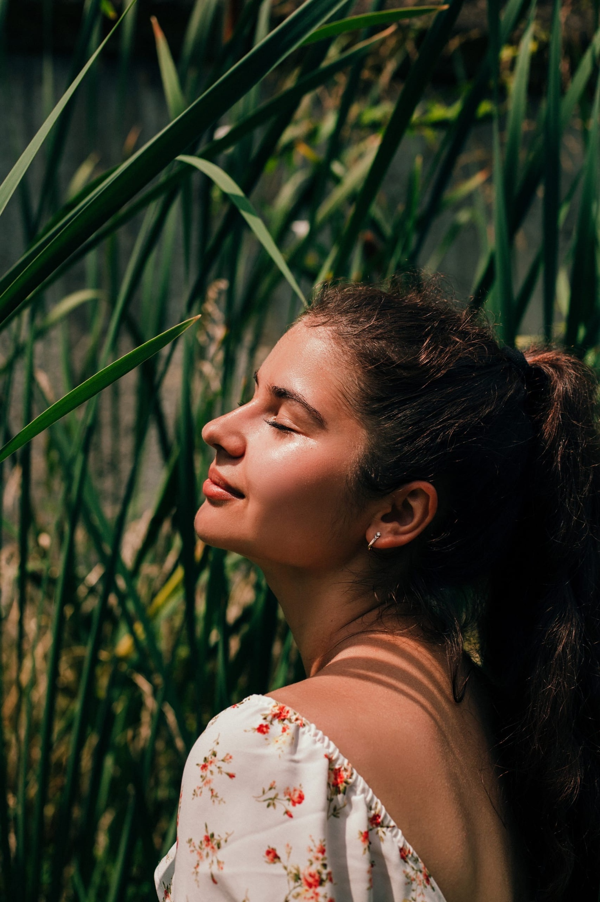

## Информация обо мне

**Личная информация:**
- родилась в г. Барнаул Алтайского края
- есть младший брат Артём
- есть кот Степан
- окончила Санкт-Петербургский государственный экономический университет

**Хобби:**
- кататься на роликах
- кататься на сноуборде
- гулять
- путешествовать по России

**Регионы нашей страны, в которых я побывала:**
1. Алтайский край
2. Республика Алтай
3. Новосибирская область
4. Санкт-Петербург
5. Ленинградская область
6. Москва
7. Московская область
8. Псковская область
9. Республика Карелия
10. Томская область
11. Мурманская область
12. Республика Северная Осетия
13. Краснодарский край
14. Новгородская область
15. Нижегородская область
16. Республика Татарстан
17. Камчатский край
18. Кемеровская область
19. Карачаево-Черкесская республика
20. Ставропольский край
21. Ярославская область
22. Ханты-Мансийский автономный округ
23. Ямало-Ненецкий автономный округ
24. Смоленская область
25. Самарская область

